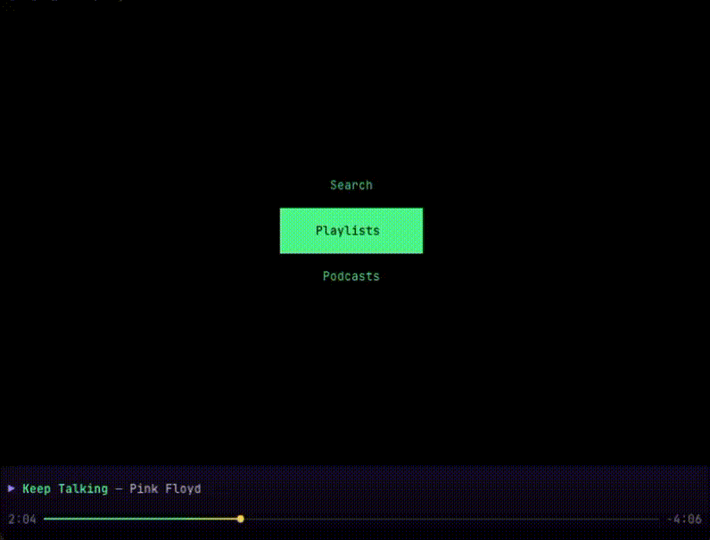
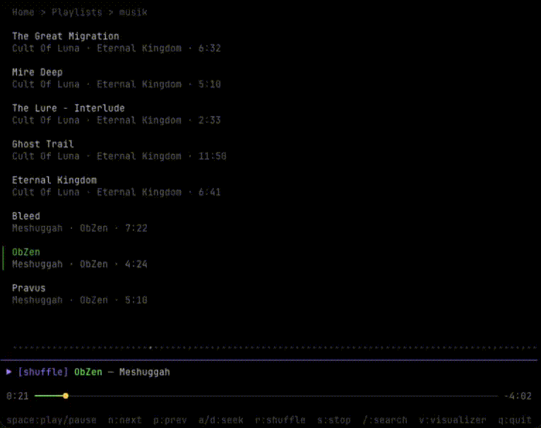

# Tuify

A terminal-based Spotify client written in Go. Browse playlists, search for music and podcasts, control playback — **Spotify without all the noise.**

 Optional [librespot](https://github.com/librespot-org/librespot) integration for direct audio streaming and real-time audio-reactive visualizers.





## Features

- **Playback Control** — Play, pause, skip, previous, shuffle, seek
- **Playlists** — Browse and play your Spotify playlists
- **Podcasts** — Browse saved shows and episodes
- **Search** — Multi-type search with prefix shortcuts:
  - `t:` Track search (default)
  - `e:` Episode search
  - `a:` Artist → Album → Track drill-down
  - `l:` Album → Track drill-down
  - `s:` Show → Episode drill-down
- **Now Playing** — Live progress bar, track info, shuffle state
- **Librespot Integration** — Optional embedded Spotify Connect player via [librespot](https://github.com/librespot-org/librespot), streaming audio directly through tuify
- **Audio-Reactive Visualizers** — Album art, spectrum analyzer, starfield, and oscillogram — all driven by real-time FFT audio analysis when librespot is enabled

## Prerequisites

- Go 1.26+
- A Premium Spotify account
- A [Spotify Developer App](https://developer.spotify.com/dashboard)
- (Optional) [librespot](https://github.com/librespot-org/librespot) — for direct audio streaming and audio-reactive visualizers

## Install

```bash
go install github.com/lounge/tuify@latest
```

Or build from source:

```bash
git clone https://github.com/lounge/tuify.git
cd tuify
go build
```

## Setup

On first run, Tuify will prompt you for your Spotify Client ID:

1. Go to https://developer.spotify.com/dashboard and create an app
2. Set the redirect URI to `http://127.0.0.1:4444/callback` (or a custom URL — see config below)
3. Check Web API checkbox
3. Copy your Client ID and paste it when prompted
4. A browser window will open to authorize with Spotify

Configuration, auth tokens, and debug logs are stored in `~/.config/tuify/` (or `$XDG_CONFIG_HOME/tuify/`).

### General Config Options

| Option | Default | Description |
|--------|---------|-------------|
| `client_id` | `""` | Spotify Developer App Client ID |
| `redirect_url` | `"http://127.0.0.1:4444/callback"` | OAuth callback URL (must match your Spotify app settings) |

### Librespot Setup

To enable librespot integration:

1. Install [librespot](https://github.com/librespot-org/librespot) and ensure it's available in your `PATH` (or set `librespot_path` in the config)
2. Set `enable_librespot` to `true` in `~/.config/tuify/config.json`

Librespot config options in `config.json`:

| Option | Default | Description |
|--------|---------|-------------|
| `enable_librespot` | `false` | Enable librespot integration |
| `librespot_path` | `"librespot"` | Path to librespot binary |
| `device_name` | `"tuify"` | Spotify Connect device name |
| `bitrate` | `320` | Audio bitrate (96, 160, or 320 kbps) |
| `spotify_username` | `""` | Optional Spotify username for direct auth |

When enabled, tuify launches librespot as a subprocess with `-60`, `--volume-ctrl fixed`, and `--disable-audio-cache`. Audio is piped through tuify for playback and real-time FFT analysis.

Select "tuify" in "Connect to a device" in Spotify client.

## Usage

```bash
./tuify
```

### Keybindings

| Key | Action |
|-----|--------|
| `Enter` | Select / play |
| `Esc` | Go back |
| `Space` | Play / pause |
| `n` | Next track |
| `p` | Previous track |
| `a` / `d` | Seek backward / forward |
| `r` | Toggle shuffle |
| `s` | Stop |
| `/` | Search |
| `v` | Toggle visualizer |
| `←` / `→` | Cycle visualizers (all 4 with librespot; album art only without) |
| `q` | Quit |

### Visualizers

| Visualizer | Description | Requires Librespot |
|------------|-------------|--------------------|
| Album Art | Displays track artwork | No |
| Spectrum | Frequency spectrum analyzer with colored bars and peak indicators | Yes |
| Starfield | 3D starfield reacting to bass and intensity | Yes |
| Oscillogram | Mirrored waveform display with smooth attack/decay | Yes |

## Testing

```bash
go test ./...
```

## Project Structure

```
tuify/
├── main.go                  # Entry point, librespot + audio pipeline setup
├── internal/
│   ├── auth/                # OAuth2 PKCE authentication
│   ├── audio/               # Real-time audio pipeline
│   │   ├── receiver.go      # Unix socket/TCP receiver for frequency data
│   │   ├── worker.go        # Audio playback + FFT analysis subprocess
│   │   ├── fft.go           # FFT → 64 logarithmic frequency bands
│   │   ├── protocol.go      # Binary frame encoding/decoding
│   │   └── types.go         # AudioFrame, frequency band definitions
│   ├── config/
│   │   └── config.go        # Configuration management
│   ├── librespot/
│   │   └── process.go       # Librespot subprocess lifecycle management
│   ├── spotify/             # Spotify API client wrapper
│   │   ├── client.go        # API methods and type converters
│   │   ├── client_test.go   # Converter tests
│   │   └── api_test.go      # API tests with HTTP mocking
│   └── ui/
│       ├── app.go           # Main app model and routing
│       ├── search.go        # Search view with drill-down
│       ├── home.go          # Home screen tabs
│       ├── nowplaying.go    # Now-playing bar
│       ├── playlist.go      # Playlist browsing
│       ├── track.go         # Track view
│       ├── podcast.go       # Podcast browsing
│       ├── episode.go       # Episode view
│       ├── progressbar.go   # Gradient progress bar
│       ├── visualizer.go    # Visualizer controller
│       ├── styles.go        # Colors and styling
│       ├── common.go        # Shared types and lazyList
│       └── visualizers/
│           ├── common.go    # Shared visualizer utilities
│           ├── albumart.go  # Album art display
│           ├── spectrum.go  # Spectrum analyzer (audio-reactive)
│           ├── oscillogram.go # Waveform display (audio-reactive)
│           └── starfield.go # 3D starfield (audio-reactive)
└── go.mod
```

## TODO

- Make it work when connected to external devices (Sonos) - doesn't work for some stupid reason... (https://github.com/spotify/web-api/issues/1337).

## Built With

- [Bubble Tea](https://github.com/charmbracelet/bubbletea) — TUI framework
- [Bubbles](https://github.com/charmbracelet/bubbles) — TUI components
- [Lip Gloss](https://github.com/charmbracelet/lipgloss) — Terminal styling
- [zmb3/spotify](https://github.com/zmb3/spotify) — Spotify Web API client
- [librespot](https://github.com/librespot-org/librespot) — Open-source Spotify Connect client
- [oto](https://github.com/ebitengine/oto) — Cross-platform audio playback

## License

MIT
