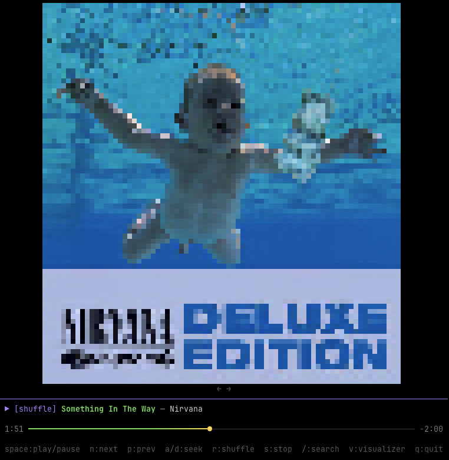

# Tuify

A terminal-based Spotify client written in Go. Browse playlists, search for music and podcasts, control playback — Spotify without all the noise.




## Features

- **Playback Control** — Play, pause, skip, previous, shuffle, seek
- **Playlists** — Browse and play your Spotify playlists
- **Podcasts** — Browse saved shows and episodes
- **Search** — Multi-type search with prefix shortcuts:
  - `t:` Track search (default)
  - `e:` Episode search
  - `a:` Artist → Album → Track drill-down
  - `l:` Album → Track drill-down
  - `s:` Show → Episode drill-down
- **Now Playing** — Live progress bar, track info, shuffle state
- **Visualizers** — Album art, starfield, and oscillogram animations

## Prerequisites

- Go 1.26+
- A Premium Spotify account
- A [Spotify Developer App](https://developer.spotify.com/dashboard)

## Install

```bash
go install github.com/lounge/tuify@latest
```

Or build from source:

```bash
git clone https://github.com/lounge/tuify.git
cd tuify
go build
```

## Setup

On first run, Tuify will prompt you for your Spotify Client ID:

1. Go to https://developer.spotify.com/dashboard and create an app
2. Set the redirect URI to `http://127.0.0.1:4444/callback`
3. Check Web API checkbox
3. Copy your Client ID and paste it when prompted
4. A browser window will open to authorize with Spotify

Configuration, auth tokens, and debug logs are stored in `~/.config/tuify/` (or `$XDG_CONFIG_HOME/tuify/`).

## Usage

```bash
./tuify
```

### Keybindings

| Key | Action |
|-----|--------|
| `Enter` | Select / play |
| `Esc` | Go back |
| `Space` | Play / pause |
| `n` | Next track |
| `p` | Previous track |
| `a` / `d` | Seek backward / forward |
| `r` | Toggle shuffle |
| `s` | Stop |
| `/` | Search |
| `v` | Toggle visualizer |
| `←` / `→` | Cycle visualizers |
| `q` | Quit |

## Testing

```bash
go test ./...
```

## Project Structure

```
tuify/
├── main.go                  # Entry point and setup
├── internal/
│   ├── auth/                # OAuth2 PKCE authentication
│   ├── config/              # Configuration management
│   ├── spotify/             # Spotify API client wrapper
│   │   ├── client.go        # API methods and type converters
│   │   ├── client_test.go   # Converter tests
│   │   └── api_test.go      # API tests with HTTP mocking
│   └── ui/
│       ├── app.go           # Main app model and routing
│       ├── search.go        # Search view with drill-down
│       ├── home.go          # Home screen tabs
│       ├── nowplaying.go    # Now-playing bar
│       ├── playlist.go      # Playlist browsing
│       ├── track.go         # Track view
│       ├── podcast.go       # Podcast browsing
│       ├── episode.go       # Episode view
│       ├── progressbar.go   # Gradient progress bar
│       ├── visualizer.go    # Visualizer controller
│       ├── styles.go        # Colors and styling
│       ├── common.go        # Shared types and lazyList
│       └── visualizers/
│           ├── common.go    # Shared visualizer utilities
│           ├── albumart.go
│           ├── oscillogram.go
│           └── starfield.go
└── go.mod
```

## TODO

- Make it work when connected to external devices (Sonos) - doesn't work for some stupid reason... (https://github.com/spotify/web-api/issues/1337).
- Visualizers that actually take the real audio data as input.
- Support for spotifyd (https://github.com/Spotifyd/spotifyd).

## Built With

- [Bubble Tea](https://github.com/charmbracelet/bubbletea) — TUI framework
- [Bubbles](https://github.com/charmbracelet/bubbles) — TUI components
- [Lip Gloss](https://github.com/charmbracelet/lipgloss) — Terminal styling
- [zmb3/spotify](https://github.com/zmb3/spotify) — Spotify Web API client

## License

MIT
